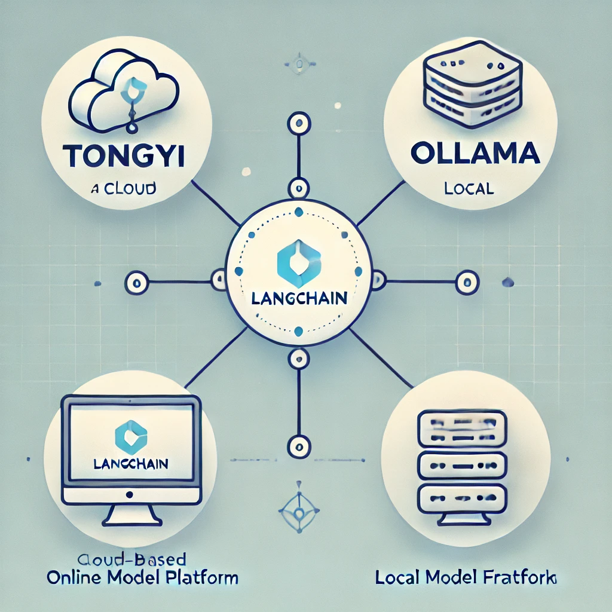
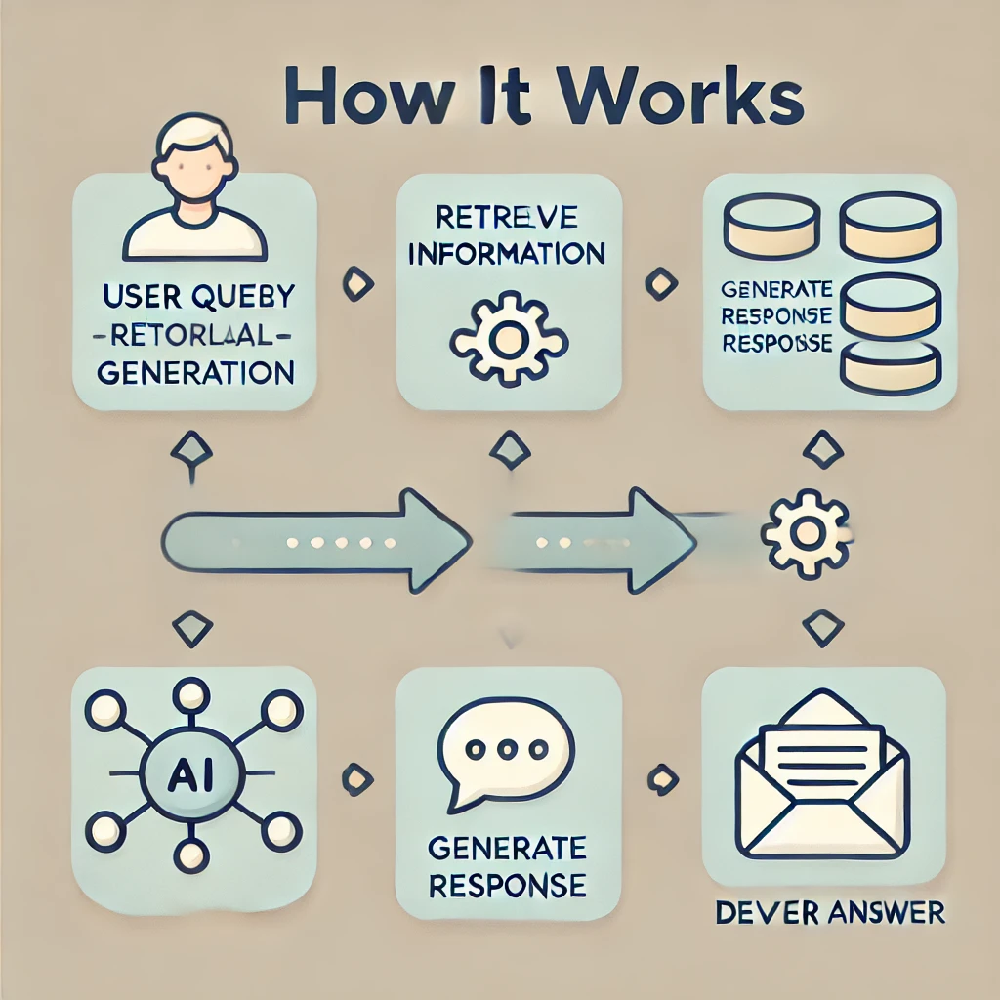

# Demo: LangChain Integration  

## Overview  

This repository provides simple examples showing how to use **LangChain** with the **Tongyi** online language model platform and the **Ollama** local language model framework.  



**LangChain** is a platform that makes it easy for developers to build powerful applications with large language models (LLMs). It simplifies the process of connecting LLMs to data sources, interacting with external systems, and creating advanced AI solutions.  

**Tongyi** is an online language model platform similar to other well-known platforms such as **ChatGPT**, **Google Gemini**, and **Baidu Qianfan**. These platforms provide robust cloud-based AI capabilities, making it possible to process natural language queries, perform advanced computations, and handle various tasks efficiently without relying on local resources.  

The examples in this repository demonstrate how to integrate **LangChain** with **Tongyi** and **Ollama**, highlighting use cases like vector search, embeddings, and Retrieval-Augmented Generation (RAG).  

Dive in and explore these tools with hands-on examples!  

## Key Features  

- **Simple Examples**: Beginner-friendly examples using **LangChain** with **Tongyi** and **Ollama**.  
- **Data Integration**: Clear guidance on how to connect **LangChain** to various data sources.  
- **Customizable**: Instructions for adapting **LangChain** to fit your specific requirements.  
- **RAG Implementation**: Demonstrates how to use Retrieval-Augmented Generation (RAG) to enhance responses.  

## Key Concepts  

### Vector Search and Embeddings  

**Vector search** enables finding relevant information by focusing on the meaning of a query, rather than just matching keywords. **Embeddings** are numerical representations of text (e.g., words or sentences) that capture their meaning. These embeddings are compared to find similar content.  

In **LangChain**, vector search identifies the most relevant information for a query by leveraging embeddings to match meanings within a database.  

### Retrieval-Augmented Generation (RAG)  

RAG combines information retrieval with text generation, enabling the model to search for relevant data from external sources and use it to generate more accurate responses.  



How it works:  
1. **User Query**: The user asks a question or makes a request.  
2. **Retrieve Information**: The query is converted into an embedding, which is used to find similar content.  
3. **Generate Response**: The retrieved data is fed into a language model like **Tongyi** or **Ollama** to generate a response.  
4. **Deliver Answer**: The model combines the retrieved data with its knowledge to produce a more accurate response.  

RAG improves the model's ability to generate precise and contextually relevant answers.  

## Setup  

1. Clone the repository:  
    ```bash
    git clone https://github.com/noahzaozao/demo_langchain.git
    cd demo_langchain
    ```  

2. Install the required dependencies:  
    ```bash
    pip install -r requirements.txt
    ```  

3. Set up your **Tongyi** and **Ollama** API keys, and configure any external data sources.  

4. Run the examples:  
    ```bash
    python example_tongyi.py
    python example_ollama.py
    ```  

## Examples  

- **Example 1**: Basic usage with LangChain and **Tongyi**.  
    - Learn how to use **Tongyi** with **LangChain** for simple text generation and queries.  

- **Example 2**: Chat history with LangChain and **Tongyi**.  
    - See how to maintain chat history for more personalized conversations.  

- **Example 3**: RAG with LangChain and **Tongyi**.  
    - Learn how to retrieve relevant data to improve the quality of responses.  

- **Example 4**: RAG and chat history with LangChain and **Tongyi**.  
    - Combine RAG with chat history to produce highly accurate and contextual answers.  

- **Example 5**: Basic usage with LangChain and **Ollama**.  
    - Understand how to use **Ollama** with **LangChain** for simple tasks.  

- **Example 6**: Chat history with LangChain and **Ollama**.  
    - Maintain conversation history while using the **Ollama** framework.  

- **Example 7**: RAG with LangChain and **Ollama**.  
    - Learn to use **Ollama** and RAG together for improved results.  

- **Example 8**: RAG and chat history with Lang
